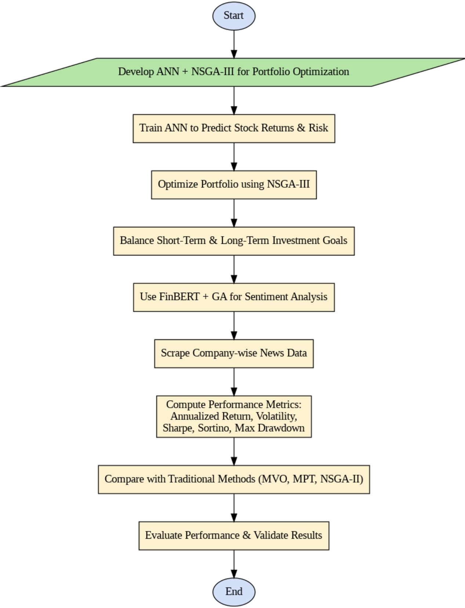

# 🧠📈 NSUT - Final Year Project: Sentiment-Aware Portfolio Optimization Web App

## 📘 Project Overview

In recent years, individual participation in financial markets has gathered pace, encouraged by increased accessibility and a stronger focus on wealth management. With investors seeking better asset allocation strategies to maximize returns while minimizing risk, advanced computational techniques have become essential.

This application implements a **hybrid portfolio optimization model** combining:

- 🧠 **Artificial Neural Networks (ANN)** for predicting stock return and risk,
- 🧬 **Non-dominated Sorting Genetic Algorithm III (NSGA-III)** for multi-objective optimization,
- 💬 **FinBERT-based sentiment analysis** for integrating news-based risk adjustment.



The system dynamically incorporates real-time market sentiment by scraping company-specific news articles and computing sentiment scores, enhancing stock selection with qualitative context. Real-world financial data is obtained using the **Yahoo Finance API (`yfinance`)**, and portfolios are evaluated using rigorous financial metrics:

- **Annualized Return**
- **Annualized Volatility**
- **Sharpe Ratio**
- **Sortino Ratio**
- **Maximum Drawdown**

Further, optimization efficacy is benchmarked by comparing **NSGA-II**, **NSGA-III**, and **MOEA/D**, identifying which algorithm performs best under different conditions and investment horizons. 

The result is a robust, AI-driven, sentiment-aware tool for advanced and personalized portfolio construction.

---

## 📁 Project Structure

```

root/
│
├── backend/        # FastAPI backend
│   ├── main.py     # Entry point for FastAPI
│   └── ...         # Other backend files (routers, models, etc.)
│
└── frontend/       # Vite + React frontend
├── src/
├── index.html
└── ...

````

---

## 🛠️ Prerequisites

Ensure the following tools are installed on your system:

- **Python 3.11+**
- **Node.js (>= 20.x) and npm**
- **pip** or **pipenv/poetry** (optional)
- **Git**

---

## 🔧 Local Setup Instructions

### 1. Clone the Repository

```bash
git clone https://github.com/Vishal-jatia/BTP-2-Portfolio-Optimization.git
cd BTP-2-Portfolio-Optimization
````

---

### 2. Backend Setup (FastAPI)

#### a. Create Virtual Environment

```bash
cd backend
python -m venv venv
source venv/bin/activate  # On Windows: venv\Scripts\activate
```

#### b. Install Dependencies

```bash
pip install -r requirements.txt
```


#### c. Run Backend Server

```bash
uvicorn app.main:app --reload
```

This will start the FastAPI server at: [http://localhost:8000](http://localhost:8000)

---

### 3. Frontend Setup (React + Vite)

Open a new terminal:

```bash
cd frontend
npm install
```

#### a. Start Development Server

```bash
npm run dev
```

This will start the Vite dev server at: [http://localhost:5173](http://localhost:5173)

> You can configure the dev port inside `vite.config.js` if needed.


---

## ✅ Environment Variables

Environment variables can be referred via  `.env.example`, create `.env` files:

### Backend (`backend/.env`):

```
OPENROUTER_API_KEY=<your_openai_key>
```

### Frontend (`frontend/.env`):

```
VITE_API_BASE_URL=http://localhost:8000
VITE_PORT=8000
```

Access in frontend via:

```js
import.meta.env.VITE_API_BASE_URL
```

---

## 📦 Build for Production

### Backend:

Make sure your FastAPI app handles CORS and can serve from a WSGI/ASGI server like `gunicorn` or `uvicorn` in production.

### Frontend:

```bash
cd frontend
npm run build
```

The production-ready files will be in `frontend/dist`.

To serve via FastAPI, use something like `StaticFiles` from `fastapi.staticfiles`:

```python
from fastapi.staticfiles import StaticFiles

app.mount("/", StaticFiles(directory="../frontend/dist", html=True), name="frontend")
```

---

## 🧪 Testing

You can test your endpoints via:

* Swagger UI: [http://localhost:8000/docs](http://localhost:8000/docs)
* ReDoc: [http://localhost:8000/redoc](http://localhost:8000/redoc)

---

## 🧹 Common Issues

* 🔄 **Port Conflicts**: Make sure ports `8000` and `5173` are free or change them.
* 🔐 **CORS Errors**: Ensure CORS is enabled in FastAPI for local frontend.
* ❓ **Missing dependencies**: Double-check your `requirements.txt` and `package.json`.

---

## 📄 License

This project is licensed under the MIT License. See the `LICENSE` file for details.

---

## 👨‍💻 Contributing

Pull requests are welcome! For major changes, please open an issue first!

---

## 📫 Contact

For any issues, please contact [nabeel.ahmed.ug21@nsut.ac.in](mailto:nabeel.ahmed.ug21@nsut.ac.in)

